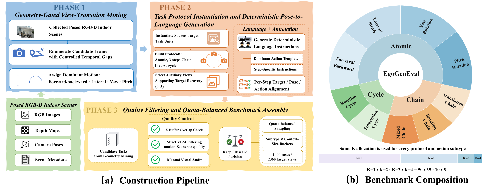

<div align="center">

# EgoGenEval

**Beyond Visual Quality: Evaluating Physical Consistency under Ego-Motion with EgoGenEval**

<p>
  Yilin Long<sup>1,2</sup> ·
  Chenming Zhu<sup>1,3</sup> ·
  Zitang Gou<sup>1,2</sup> ·
  Jingli Lin<sup>1,4</sup> ·
  Tai Wang<sup>1,‡</sup>
</p>
<p>
  <sup>1</sup> Shanghai AI Laboratory ·
  <sup>2</sup> Fudan University ·
  <sup>3</sup> The University of Hong Kong ·
  <sup>4</sup> Shanghai Jiao Tong University<br>
  <sup>‡</sup> Corresponding author
</p>

[](https://arxiv.org/html/2609.11172v1)
[](https://www.python.org/downloads/)
[](LICENSE)

<p>
  <a href="docs/local_data.md">📦 Dataset Preparation</a> |
  <a href="#-quick-start">🚀 Quick Start</a>
</p>

</div>

**TL;DR.** EgoGenEval evaluates whether image, video, and world models execute
language-specified ego-motion while preserving the surrounding scene. One scoring
command reports Camera-Motion Geometry (CMG), Scene and Spatial Preservation (SSP),
and their mean.

<div align="center">
  
</div>

## 🔥 News

- 🔥[2026-09-10]: We released our [paper](https://arxiv.org/html/2609.11172v1), [benchmark](#-overview), and evaluation codes.

## 📖 Overview

EgoGenEval measures two complementary axes of physical consistency:

| Metric | Question | Evidence |
|---|---|---|
| **CMG** — Camera-Motion Geometry | Is the requested motion realized? | estimated relative pose, depth-calibrated |
| **SSP** — Scene and Spatial Preservation | Is the environment preserved? | object retention, position, depth order, integrity |
| **Overall** | | `(CMG + SSP) / 2` |

The benchmark contains **1,400 cases / 2,360 target views** from HyperSim, ScanNet,
ScanNet++, and Matterport3D: 800 atomic cases, 360 three-step chains, and 240 two-step
inverse cycles, each with K=1–4 input views. In all 600 multi-step cases, the model's
own previous output becomes the next step's input.

## 🏆 Leaderboard

**Pose-Free Track (Primary Evaluation).** Overall = (CMG + SSP) / 2.

| Model | Overall | CMG | SSP |
|---|:---:|:---:|:---:|
| **_Closed-Source Image Generators_** | | | |
| GPT-Image-2 | 0.662 | 0.721 | 0.602 |
| Seedream-5.0 | 0.615 | 0.688 | 0.542 |
| Gemini-3-Pro-Image | 0.572 | 0.593 | 0.551 |
| **_Open-Source Image Generators_** | | | |
| HiDream-O1 | 0.524 | 0.484 | 0.563 |
| FLUX.2-dev | 0.501 | 0.448 | 0.554 |
| HunyuanImage-3.0 | 0.498 | 0.462 | 0.534 |
| Qwen-Image-Edit-2511 | 0.495 | 0.470 | 0.520 |
| OmniGen2 | 0.438 | 0.423 | 0.453 |
| Step1X-Edit | 0.436 | 0.298 | 0.575 |
| ACE++ | 0.400 | 0.392 | 0.408 |
| FireRed-Image-Edit-1.1 | 0.390 | 0.406 | 0.373 |
| ICEdit | 0.316 | 0.338 | 0.295 |
| **_Unified Multimodal Models_** | | | |
| BAGEL-7B-MoT | 0.451 | 0.435 | 0.466 |
| Emu3.5-Image | 0.324 | 0.443 | 0.205 |
| **_Generic Video Models_** | | | |
| Kling-2.1 | 0.604 | 0.744 | 0.465 |
| Seedance-1.0-Pro-Fast | 0.528 | 0.607 | 0.448 |

**Pose-Conditioned Track (Reference Only).** These systems receive ground-truth
6-DoF and are not directly comparable to the pose-free track.

| Model | Overall | CMG | SSP |
|---|:---:|:---:|:---:|
| **_Pose-Conditioned World Models_** | | | |
| HY-WorldMirror-2.0 | 0.664 | 0.847 | 0.481 |
| Lingbot-World | 0.639 | 0.747 | 0.530 |

**Unranked Score Calibration.**

| Model | Overall | CMG | SSP |
|---|:---:|:---:|:---:|
| GT-target oracle | 0.940 | 0.980 | 0.899 |

The oracle is a practical evaluator ceiling rather than a mathematical upper bound.

Submit a result through the
[leaderboard issue template](https://github.com/InternRobotics/EgoGenEval/issues/new?template=leaderboard.yml)
with `results.json` and `run_config.json`.

## 🔍 Key Findings

- Similar visual quality can mask very different camera-motion and
  scene-preservation behavior.
- Physical consistency degrades over multi-step rollouts, especially inverse returns.
- Direction-correct motions commonly under-execute the requested magnitude.
- Additional input views can improve CMG while reducing SSP.

## 🚀 Quick Start

### 1. Install

```bash
git clone https://github.com/InternRobotics/EgoGenEval.git
cd EgoGenEval
pip install -e ".[full,data,prepare,scannetpp]"
```

Download the four evaluator checkpoints listed in
[`THIRD_PARTY.md`](THIRD_PARTY.md). Copy
[`configs/evaluator.example.yaml`](configs/evaluator.example.yaml) to
`configs/evaluator.local.yaml` and fill in the five local paths.

Depth Anything 3 also requires dependencies from its own checkout:

```bash
pip install omegaconf pycolmap evo 'moviepy<2'
egogeneval doctor --full --evaluator-config configs/evaluator.local.yaml
```

Run `doctor` before evaluation; formal scoring fails if a required evaluator
component is unavailable.

### 2. Prepare the benchmark locally

Follow the [data preparation guide](docs/local_data.md) to download the official
source datasets and EmbodiedScan v1 camera annotations. On Linux, prepare all
four datasets with one command:

```bash
egogeneval prepare-benchmark \
  --hypersim /datasets/hypersim \
  --scannet /datasets/scannet \
  --matterport3d /datasets/matterport3d \
  --scannetpp /datasets/scannetpp \
  --embodiedscan /datasets/embodiedscan \
  --output prepared-data/egogeneval
```

The command reconstructs RGB, depth and cameras, verifies their fingerprints,
and produces the generation and evaluation inputs in one directory. Source
data remains unchanged. See the guide for the reference rendering environment
and optional dataset subsets.

### 3. Generate your model's outputs

Read `prepared-data/egogeneval/generation_inputs.jsonl` with your model's inference
code. Image paths are relative to `prepared-data/egogeneval/`.

1. For each case, use the `input_images` entry with `role: current` as Image 1.
   Image models also receive `auxiliary_context` views in their listed order.
2. Run each instruction in step order, using its `text` unchanged. For Chain and
   Cycle cases, replace the current view with the previous generated output for
   the next call; keep auxiliary views fixed. Ground-truth targets are reserved
   for evaluation.
3. Save each output to `runs/mymodel/outputs/<sample_id>/step<N>.png` (steps start
   at 1). Clip and frame-directory conventions are described [below](#write-outputs).

The inference call depends on your model/API. Video and world-model interfaces
receive only the current view and instruction; use the last generated frame of
each step segment as the next current view. The preparation script supplies the
inputs, but does not run your generation model.

Use `generation_inputs.jsonl` for the default pose-free model feed and preserve
`manifest.jsonl` for scoring. The latter retains canonical source references and
ground-truth metadata. See the [generation walkthrough](docs/local_data.md#generate-and-evaluate).

### 4. Score a generation directory

```bash
egogeneval score \
  --manifest prepared-data/egogeneval/manifest.jsonl \
  --generations runs/mymodel \
  --model-id my-model \
  --model-type image \
  --eval-frames prepared-data/egogeneval \
  --evaluator-config configs/evaluator.local.yaml \
  --output runs/mymodel/evaluation
```

Change `--model-type` to `video`, `world-model`, or `pose-conditioned` when
needed. The command discovers outputs, validates every step declared by the
selected manifest (2,360 steps for the full benchmark), runs CMG and SSP, and
writes `results.json`, evidence JSONL files, and `run_config.json`. Add `--resume`
after an interrupted scoring run.

## 🧪 Evaluate Your Model

### Supported model types

| `--model-type` | Input interface | Output per step |
|---|---|---|
| `image` | one or multiple images + instruction | one image |
| `video` | current image + instruction | clip or frame directory |
| `world-model` | current image + instruction, with model state | image, clip, or frame directory |
| `pose-conditioned` | current image + instruction + native 6-DoF | image, clip, or frame directory |

For clips and frame directories, the **last frame of each step segment is scored**.
For Chain and Cycle cases, use that same frame as the next step's input. Video and
world-model interfaces use only the current view; auxiliary K>1 views are not passed.

### Write outputs

```text
runs/mymodel/
  outputs/
    <case_id>/step1.png
    <case_id>/step2.mp4
    <case_id>/step3/
```

A flat `outputs/<case_id>_step<N>.<ext>` layout is also accepted. Missing or
ambiguous steps fail validation. Generate Chain and Cycle cases sequentially,
feeding the selected final frame from step `N` into step `N+1`.

Then run the single scoring command shown in
[Quick Start](#4-score-a-generation-directory).

## 📏 Evaluation Contract

CMG estimates the direction and magnitude of relative camera motion using DA3 and
metric-depth calibration. SSP measures object retention, spatial relations, depth
order, and integrity. Overall is their mean, macro-averaged across Atomic, Chain, and
Cycle protocols.

- [Third-party models and licenses](THIRD_PARTY.md)
- [Dataset terms](DATA_TERMS.md)

## 📝 Citation

If you find EgoGenEval useful in your research, please cite our
[paper](https://arxiv.org/html/2609.11172v1):

```bibtex
@article{long2026egogeneval,
  title={Beyond Visual Quality: Evaluating Physical Consistency under Ego-Motion with {EgoGenEval}},
  author={Long, Yilin and Zhu, Chenming and Gou, Zitang and Lin, Jingli and Wang, Tai},
  journal={arXiv preprint arXiv:2609.11172},
  year={2026},
  eprint={2609.11172},
  archivePrefix={arXiv},
  primaryClass={cs.CV},
  url={https://arxiv.org/abs/2609.11172}
}
```

## License

Code is licensed under MIT. Source-dataset terms continue to apply to benchmark
images; see [`DATA_TERMS.md`](DATA_TERMS.md).

## 🙏 Acknowledgments

We sincerely thank the teams behind [HyperSim](https://github.com/apple/ml-hypersim),
[ScanNet](http://www.scan-net.org/),
[ScanNet++](https://kaldir.vc.in.tum.de/scannetpp/), and
[Matterport3D](https://niessner.github.io/Matterport/) for providing the datasets
that make EgoGenEval possible. We also thank the open-source community for the
models and tools used in our evaluation pipeline; see
[`THIRD_PARTY.md`](THIRD_PARTY.md) for details.

## Contact

Please open a [GitHub issue](https://github.com/InternRobotics/EgoGenEval/issues).
